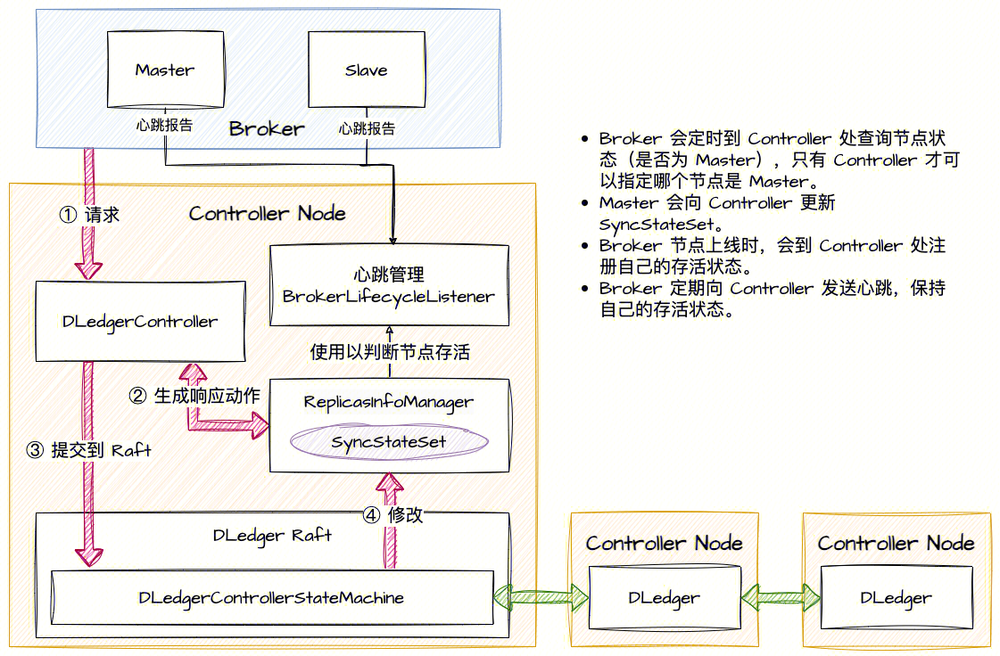
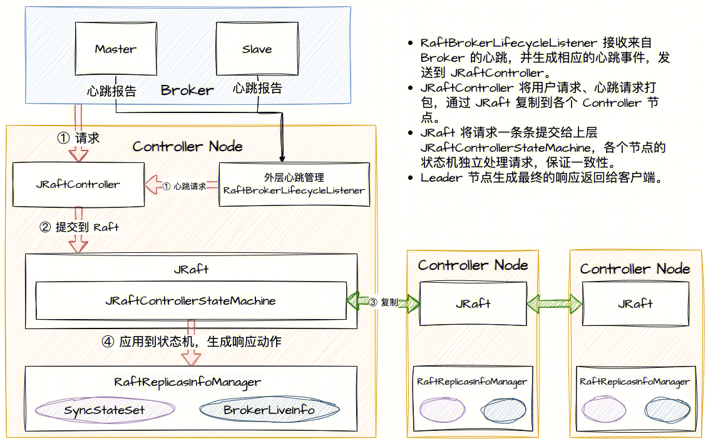

# Status
Current State: Accept
Authors: [yulangz](https://github.com/yulangz)
Shepherds: zhouxinyu,rongtong,fuyou
Mailing List discussion: dev@rocketmq.apache.org
Pull Request: #7301
Released: <relased_version>

# Background & Motivation
## What do we need to do
- Will we add a new module?
No new modules will be added, but a new implementation will be added for the Controller interface.
- Will we add new APIs?
No additions or modifications to any client-level and admin-tool APIs. There will be some new interfaces and APIs.
- Will we add new feature?
No, JRaft Controller is a new implementation, but not a new future.

## Why should we do that
- Are there any problems of our current project?
Yes, there are some issues with the current DLedger Controller:

是的，当前的 DLedger Controller 存在一些问题：


1. DLedger, as a Raft repository specifically designed for RocketMQ CommitLog, uses some specialized triggers for CommitLog. For example, DLedger does not implement a snapshot based log truncation function, but instead uses an expiration mechanism to directly discard logs that have exceeded their storage time. This scheme works well as a CommitLog repository, as logs that have exceeded their retention time can be simply discarded. However, when it comes to providing distributed consensus and consistency assurance for upper level state machines, this approach is not very suitable. After an unexpected machine failure, in order to restore the state machine in memory, it is necessary to apply Raft logs one by one to the upper layer. Therefore, all logs must be saved and the timeout deletion mechanism cannot be enabled. Without implementing the snapshot interface, DLedger's logs will grow infinitely, ultimately exceeding the machine's disk capacity. At the same time, the time for fault recovery will also be infinitely extended, which is unacceptable.

1. DLedger 作为一个专门为 RocketMQ CommitLog 设计的 Raft 存储库，使用了一些专门针对于 CommitLog 的 trick。例如，DLedger 没有实现基于 Snapshot 的日志截断功能，而是使用过期机制，直接将超过存储时间的日志丢弃掉。这种方案在作为 CommitLog 存储库的时候运行良好，因为已经超过保存时间的日志可以被简单地丢弃掉。但是，在作为为上层状态机提供分布式共识与一致性保障的时候，这种方案就不太合适了。当机器意外故障以后，为了恢复内存中的状态机，需要将 Raft 日志一条一条应用到上层，因此，所有的日志都必须被保存，不可以启用超时删除的机制。在没有实现 Snapshot 接口的背景下，DLedger 的日志会无限增长，最终超过机器磁盘容量。同时，故障恢复的时间也会被无限延长，这是不可接受的。


As shown in the following figure, the design of the DLedger Controller does not meet linear consistency:

2. 如下图所示，DLedger Controller 的设计不满足线性一致性：



The core function of the Controller is to manage the liveness status of the nodes and the `SyncStateSet` to achieve automatic election of the Master.

Controller 的核心是管理节点存活状态，以及 `SyncStateSet`，以此来完成 Master 的自动选举。


Let's describe the workflow of the DLedger Controller using the example of an `AlterSyncStateSet` request:

以 `AlterSyncStateSet` 请求为例，描述 DLedger Controller 的运行流程：


1. The Master Broker generates an `AlterSyncStateSet` request, which includes the desired `SyncStateSet` to switch to.
2. DLedgerController queries the current `SyncStateSet` from ReplicasInfoManager and generates a response action based on it (e.g., adding/removing nodes from the `SyncStateSet`).
3. DLedgerController submits this response action (event) to DLedgerRaft. DLedger is responsible for replicating this event to other Controller nodes. Once consensus is reached, the event is submitted to the DLedgerControllerStateMachine.
4. DLedgerControllerStateMachine modifies the data in ReplicasInfoManager based on the event.
5. The Broker's heartbeat reaches the BrokerLifecycleListener through a separate link, which is not routed through Raft, and is detected by ReplicasInfoManager.

1. Master Broker 生成 `AlterSyncStateSet` request，包含了想要切换到的 `SyncStateSet`。
2. DLedgerController 到 ReplicasInfoManager 内去查询当前的 `SyncStateSet`，并以此生成响应动作（如：将哪个节点加入/移出 `SyncStateSet`）。
3. DLedgerController 将这个响应动作（`event`）提交到 DLedgerRaft，DLedger 负责将这个 `event` 复制到其他 Controller 节点，得到共识后将 `event` 提交到状态机 DLedgerControllerStateMachine。
4. DLedgerControllerStateMachine 根据 `event`，修改 ReplicasInfoManager 内的数据。
5. Broker 的心跳从另一条链路到达 BrokerLifecycleListener，并被 ReplicasInfoManager 感知，这条链路不会经过 Raft。


The above workflow has a significant issue of not satisfying linear consistency. Since the processing of the request happens before Raft, a response action generated using potentially outdated data may occur. Let's illustrate this with an example:

以上的链路，存在一个最明显的问题，就是不满足线性一致性，因为请求的处理在 Raft 之前，所以，一个请求在生产响应动作的时候，可能使用的过期数据生成的响应动作，以下举例说明：


Suppose there is a Broker Master A that triggers two consecutive `AlterSyncStateSet` requests.
The initial `SyncStateSet` in ReplicasInfoManager is `{A, B}`.
For the two `AlterSyncStateSet` requests, the first one is `{A, B, C}`, and the second one is `{A, B}` (removing node C).
Assume that the first request completes step 2, generating an `event` to insert node C into the `SyncStateSet`. It is currently in the process of Raft replication (step 3) and has not reached step 4 yet.
At this point, the second request arrives at the Controller. Since the `SyncStateSet` is still `{A, B}`, the Controller assumes that the `SyncStateSet` has not changed and directly returns a Fail response to the requesting client. It does not proceed to submit to Raft (based on the code logic).
Finally, the first request completes step 3, and the data is broadcasted to all Controller nodes, eventually completing step 4 by inserting node C into the `SyncStateSet`.
As a result, the final state of the `SyncStateSet` is `{A, B, C}`, while the expected state is `{A, B}`.

假设存在一个 Broker Master A，连续触发了两次 `AlterSyncStateSet`。
ReplicasInfoManager 中最初的 `SyncStateSet` 为 `{A, B}`。
两次 `AlterSyncStateSet` 请求，第一次为 `{A, B, C}`，第二次为 `{A, B}`。（第一次将节点 C 加入 `SyncStateSet`，第二次将其移出）
假设第一个请走走完了步骤 ②，生成了一个将节点 C 插入 `SyncStateSet` 的 `event`，正在步骤 ③ Raft 复制中，还没有走到步骤 ④，
此时，第二个请求到达了 Controller，由于 `SyncStateSet` 还是 `{A, B}`，因此 Controller 认为 `SyncStateSet` 未发生改变，直接返回 Fail 给请求的客户端。不会继续提交到 Raft（代码内的逻辑）。
最后，第一次的请求走完了步骤 ③，数据广播到各个 Controller 节点，并最终完成步骤 ④，将节点 C 插入了 `SyncStateSet`。
此时，`SyncStateSet` 的最终状态为 `{A, B, C}`，而预期的状态为 `{A, B}`。


The issue of inconsistent metadata within the Controller[[Summer of code] Let controller become role state after append initial logs by hzh0425 · Pull Request #4442 · apache/rocketmq (github.com)](https://github.com/apache/rocketmq/pull/4442) stems from this problem.

Controller 内元数据的不一致的问题[[Summer of code] Let controller become role state after append initial logs by hzh0425 · Pull Request #4442 · apache/rocketmq (github.com)](https://github.com/apache/rocketmq/pull/4442)，其根源在在于此。


Similarly, the heartbeat management, which operates independently of the Raft link, can also encounter problems.

同样的，心跳管理部分独立在 Raft 链路之外，也是有可能出现问题的。


What can we benefit proposed changes?
Through this proposal, users can use the JRaft Controller to replace the DLedger Controller, which implements the snapshot function and can regularly create snapshots of the state machine and truncate logs to avoid infinite growth of Raft logs. At the same time, the JRaft Controller underwent refactoring during design to avoid the issue of linear inconsistency.

通过该提案，用户可以使用 JRaft Controller 替代 DLedger Controller，它实现了 Snapshot 功能，可以定期对状态机创建快照并截断日志，避免 Raft 日志无限增长。同时，JRaft Controller 在设计时进行了重构，避免了线性不一致的问题。

# Goals
## What problem is this proposal designed to solve?
1. The problem of infinite growth of Raft logs caused by incomplete DLedger design.
2. Nonlinear consistency issues caused by incomplete design of DLedger Controller.

1. DLedger 设计不完善导致的 Raft 日志无限增长的问题。
2. DLedger Controller 设计不完善导致的非线性一致性问题。
# Non-Goals
## What problem is this proposal NOT designed to solve?
This proposal does not propose a new multi copy storage mechanism, but rather an improvement on the existing architecture.

本提案并没有提出一种新的多副本存储机制，而是在原有的架构上进行的改善。
# Changes
## New Configuration
```java
# 可选 jRaft、DLedger，默认 DLedger
controllerType=jRaft

# jRaft 相关
# 选举超时时间，默认 1 秒
jRaftElectionTimeoutMs=1000
# 进行 Snapshot 的间隔，默认 1 小时，此处建议更长的时间，如 1 天、3 天
jRaftSnapshotIntervalSecs=3600
# group id
jRaftGroupId=jRaft-Controller
# 本机 jraft 的地址
jRaftServerId=localhost:9880
# jraft 组的地址
jRaftInitConf=localhost:9880,localhost:9881,localhost:9882
# jRaft Controller 中，jRaft 与 提供给 Broker 的 RPCService 不共用套接字资源，下面设置的是 Controller 上监听 Broker RPC 的端口。注意 IP 与端口要与 jRaftInitConf 一一对应。
jRaftControllerRPCAddr=localhost:9770,localhost:9771,localhost:9772
```
## Architecture



In JRaft Controller, all request responses are pushed down to the state machine layer. Additionally, the heartbeat of the Broker, as a request, goes through Raft replication and broadcasting before being submitted to the state machine.
This design ensures two points:
1. All request responses are processed at the state machine layer, eliminating the possibility of generating response actions using outdated data and ensuring linear consistency.
2. The liveness status of the nodes is reported to the state machine through Raft, allowing it to be recovered from Raft logs.
By incorporating these mechanisms, JRaftController ensures that both request processing and node liveness status are handled consistently and reliably within the system.

在 JRaft Controller 中，将所有的请求响应都下推到了状态机层面，同时，Broker 的心跳也作为一个请求会去经过 Raft 复制与广播，最终提交到状态机。
这种设计保证了两点：
1. 所有的请求响应都是在状态机层面进行，不会利用旧数据生成响应动作，保证了线性一致性。
2. 节点的存活状态也会经过 Raft 报告给状态机，可以通过 Raft 的 log 复原出来。


In the implementation of heartbeats, JRaftController chooses to fix the timestamp of the heartbeat at the RaftBrokerLifecycleListener instead of checking the heartbeat time in the StateMachine. This ensures that the heartbeat time observed by each Controller node for the Broker remains consistent.

在心跳的实现中，JRaft Controller 选择的是在 RaftBrokerLifecycleListener 处固定下心跳的时间戳，而不是在 StateMachine 再判断心跳时间，以此保证到各个 Controller 节点观测到的 Broker 心跳时间都是一致的。

# Rejected Alternatives 
Perhaps other Raft libraries can be used to implement Controller.
## How does alternatives solve the issue you proposed?
Same as JRaft Controller.
## Pros and Cons of alternatives
This depends on the Raft library actually used, and different Raft libraries have different characteristics.
## Why should we reject above alternatives
JRaft is mature enough, has undergone large-scale production testing, and is capable of achieving the functions we need.
# Attachments
[Fault injection test report](https://docs.google.com/document/d/1eWaKHcs3jGoWtqzmhQovhvKecY1EFW9BLIP0pfA-5fQ/edit#heading=h.l30nq6bc87fs)
[jRaft Controller 故障测试报告](https://docs.google.com/document/d/1eWaKHcs3jGoWtqzmhQovhvKecY1EFW9BLIP0pfA-5fQ/edit#heading=h.l30nq6bc87fs)
